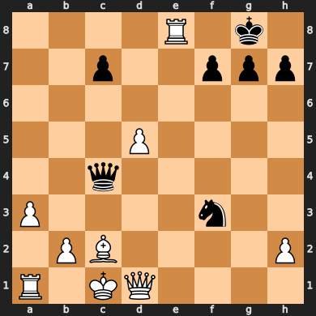
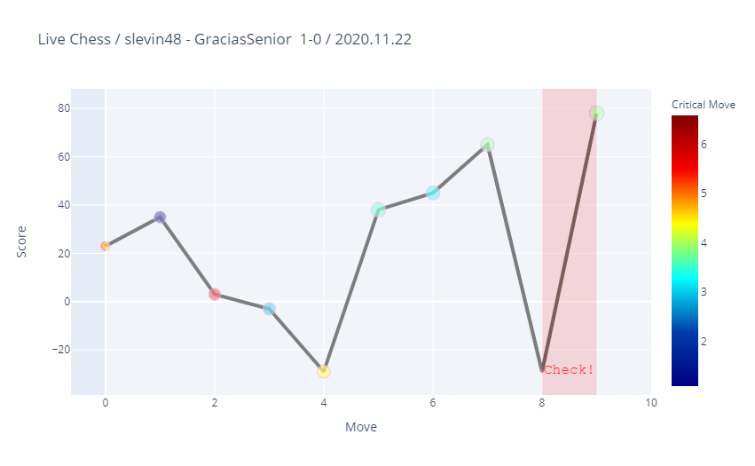
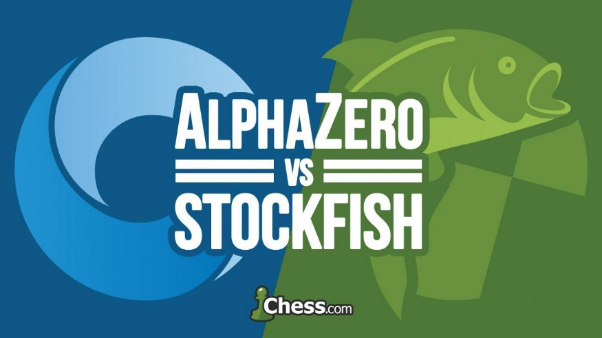
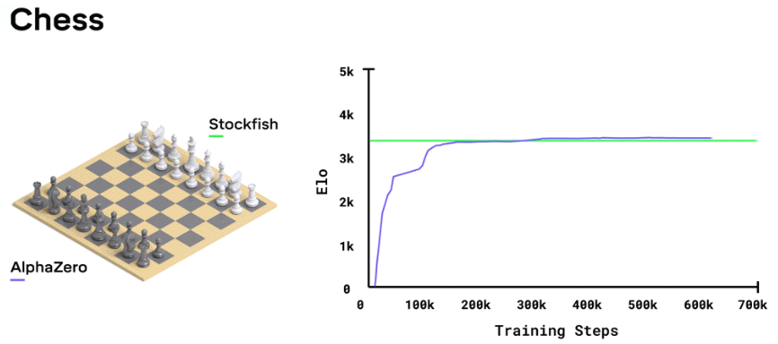

# Chess [](https://share.streamlit.io/slevin48/chess/main/chess-app.py)

Analyzing chess games and rendering as a [web app](https://share.streamlit.io/slevin48/chess/main/chess-app.py)



Match plot:



## Stockfish

[Stockfish](https://stockfishchess.org/) is an open source chess engine

```python
import chess
import chess.engine

def stockfish_evaluation(board, time_limit = 0.01):
    engine = chess.engine.SimpleEngine.popen_uci("/usr/games/stockfish")
    result = engine.analyse(board, chess.engine.Limit(time=time_limit))
    engine.quit()
    return result['score']

board = chess.Board("rnbqkbnr/pppppppp/8/8/8/8/PPPPPPPP/RNBQKBNR w KQkq - 0 1")
result = stockfish_evaluation(board)
print(result)
```

[Analysing and evaluating a position](https://python-chess.readthedocs.io/en/latest/engine.html#analysing-and-evaluating-a-position):

```python
import chess
import chess.engine

engine = chess.engine.SimpleEngine.popen_uci("/usr/games/stockfish")

board = chess.Board("r1bqkbnr/p1pp1ppp/1pn5/4p3/2B1P3/5Q2/PPPP1PPP/RNB1K1NR w KQkq - 2 4")
info = engine.analyse(board, chess.engine.Limit(depth=20))
print("Score:", info["score"])
# Score: PovScore(Mate(+1), WHITE)

engine.quit()
```

## AlphaZero

Mentally play through possible future scenarios, giving priority to promising paths, whilst also considering how others are most likely to react to your actions and continuing to explore the unknown.

After reaching a state that is unfamiliar, evaluate how favourable you believe the position to be and cascade the score back through previous positions in the mental pathway that led to this point.

After you’ve finished thinking about future possibilities, take the action that you’ve explored the most.

At the end of the game, go back and evaluate where you misjudged the value of the future positions and update your understanding accordingly.

[How to build your own AlphaZero AI using Python and Keras
](https://medium.com/applied-data-science/how-to-build-your-own-alphazero-ai-using-python-and-keras-7f664945c188)

## AlphaZero vs Stockfish





## Resources

Code:
* [Python-chess](https://github.com/niklasf/python-chess) + ([Doc](https://python-chess.readthedocs.io/en/latest/))
* [Programming a Chess Player](https://jupyter.brynmawr.edu/services/public/dblank/CS371%20Cognitive%20Science/2016-Fall/Programming%20a%20Chess%20Player.ipynb)
* [Deep Pink](https://github.com/erikbern/deep-pink)
* [Chess annotator](https://pypi.org/project/chess-annotator/)
* [python-chess-analysis](https://github.com/mptedesco/python-chess-analysis)
* [Chess-Graphical-Evaluation](https://github.com/rafaelmcam/Chess-Graphical-Evaluation)
* [Python-Easy-Chess-GUI](https://github.com/fsmosca/Python-Easy-Chess-GUI)
* [Chess analysis D3js](https://github.com/m-hou/Chess-Analysis)
* [Python chess graph](https://github.com/Destaq/chess_graph)

Articles:
* [Using Deep Learning to train a Deep Search Chess Algorithm](https://towardsdatascience.com/creating-a-chess-engine-with-deep-learning-b9477ff3ee3d)
* [How to build your own AlphaZero AI using Python and Keras
](https://medium.com/applied-data-science/how-to-build-your-own-alphazero-ai-using-python-and-keras-7f664945c188)
* [Analyzing Chess with Pandas to Learn from the Best and Raise My Rating](https://medium.com/@crawftv/analyzing-chess-with-pandas-to-learn-from-the-best-raise-my-rating-1bf22f28b83)
* [Modeling a ChessBoard And Mechanics Of Its Pieces In Python](https://impythonist.wordpress.com/2017/01/01/modeling-a-chessboard-and-mechanics-of-its-pieces-in-python/amp/)
* [A Visual Look at 2 Million Chess Games](https://blog.ebemunk.com/a-visual-look-at-2-million-chess-games/)
* [Chessviz](https://andreasstckl.medium.com/chessviz-graphs-of-chess-games-7ebd4f85a9b9)
* [Machine Learning for Chess — AlphaZero vs Stockfish](https://mmsubra1.medium.com/machine-learning-for-chess-alphazero-vs-stockfish-b58638e73fee)
* [AlphaZero Crushes Stockfish In New 1,000-Game Match](https://www.chess.com/news/view/updated-alphazero-crushes-stockfish-in-new-1-000-game-match)