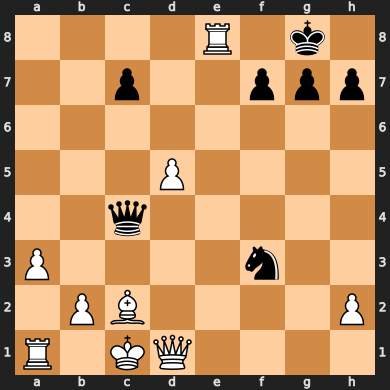

# Chess 

Analyzing chess games and rendering as a [web app](https://share.streamlit.io/slevin48/chess/main/chess-app.py)

## AlphaZero

Mentally play through possible future scenarios, giving priority to promising paths, whilst also considering how others are most likely to react to your actions and continuing to explore the unknown.

After reaching a state that is unfamiliar, evaluate how favourable you believe the position to be and cascade the score back through previous positions in the mental pathway that led to this point.

After you’ve finished thinking about future possibilities, take the action that you’ve explored the most.

At the end of the game, go back and evaluate where you misjudged the value of the future positions and update your understanding accordingly.

[How to build your own AlphaZero AI using Python and Keras
](https://medium.com/applied-data-science/how-to-build-your-own-alphazero-ai-using-python-and-keras-7f664945c188)